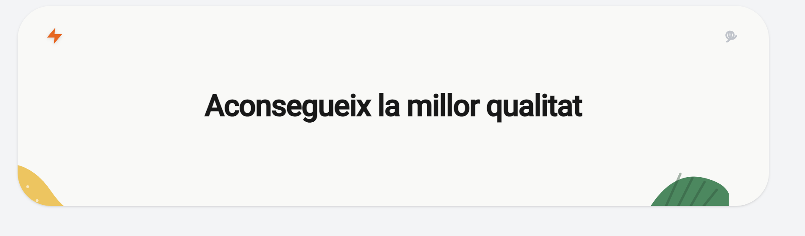

# PROJECT 2: BUDGET by Albert Muntal

Budget is a small Catalan budgeting application built with Angular 22, Tailwind CSS, and Angular Material. The app helps users select services, request a budget, track budget history, and see details for each budget.

---

## How the app works

The app is organized around a main dashboard that brings together:

- A **header** hero section
- A set of **service cards** that the user can select.
- A **budget summary** that updates in real time.
- A **request budget form** with validation.
- A **budget history** list with search and sort.
- A **detailed budget page** for viewing each budget.
- The possibility to **export each individual budget as a PDF**.


### User flow

1. The user opens the app and sees the landing card header.
2. They select one or more service cards and, if available, add extra pages or languages.
3. The budget summary updates automatically with the current total.
4. The user completes the budget request form and submits it.
5. The request is saved locally and appears in the budget history.
6. The user can click a budget from the history to view full details and print/PDF.

---

## Main components

### Header

The `Header` component shows the main hero message, visual branding, and responsive behavior.



### Cards

Each `Card` represents a service offering. Cards support:

- Selecting the service with a checkbox.
- Showing extra options like pages and languages.
- Calculating the final cost in real time.
- Opening a small modal with more info.


### Budget Summary

The `BudgetSummary` component displays the current total price and updates whenever card selections change.


### User Form

The `UserForm` component collects user data and validates:

- Name is required.
- Phone must be 9 digits.
- Email must be valid.

It is mobile-friendly and accessible.


### Budget History

The `BudgetHistory` component keeps a running list of submitted budgets. It includes:

- A search box.
- Sort buttons for date, price, and name.
- Budget cards with details and links.


### Detailed Budget

The `DetailedBudget` component shows the full content of a selected budget and includes a print/PDF view.


---

## Project structure

Key folders and files:

- `src/app/components/` — component templates, styles, and tests
- `src/app/services/budgets-local-storage.ts` — local storage persistence for budgets
- `src/app/models/` — TypeScript interfaces for budget, card, and form data
- `src/public/data/mock-budgets.ts` — initial budget examples
- `docs/readme-assets/` — screenshots used in this README

---

## Technology stack

- Angular 22.0.x
- Tailwind CSS 4.3.x
- Angular Material 22.0.x
- TypeScript 6.x
- Vitest / Angular unit testing

---

## Run locally

Install dependencies:

```bash
npm install
```

Start the dev server:

```bash
ng serve
```

Open the app at:

```text
http://localhost:4200/
```

---

## Tests

Run the unit tests with:

```bash
ng test
```

This project includes component specifications for all major views and logic paths.

---

## Deployment with Vercel

This project is ready to deploy on Vercel.

Suggested deployment steps:

1. Connect the repository to Vercel.
2. Set the build command to:

```bash
npm run build
```

3. Set the output directory to:

```text
dist/budget-albert
```

4. Deploy.

> The app has not yet been deployed to Vercel, but these settings are the expected configuration.

---

## Notes

- The budget history is saved locally in the browser using `localStorage`.
- The UI is mobile-first and uses responsive Tailwind breakpoints.
- The app is designed for keyboard accessibility and includes aria attributes for forms and buttons.

---

## Assets

Screenshots used for the README are stored in `docs/readme-assets/`.

If you want, I can also add a short `vercel.json` section or a deployment checklist with screenshots.
